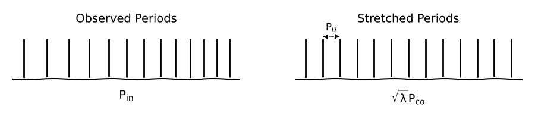
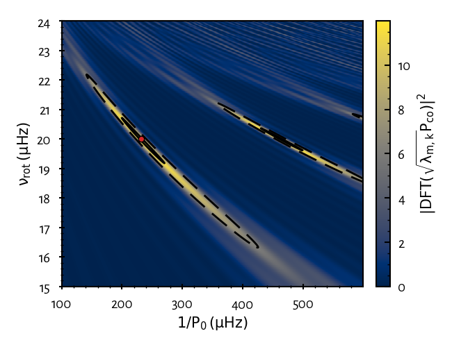

How does it work?
=================

Here, we describe how morse proceed for the seismic analysis of oscillation
spectra. We will first need to introduce some key concepts about oscillations in
rotating stars.

Theoretical background: low-frequency oscillations in rotating stars
--------------------------------------------------------------------

For non-rotating stars, the periods :math:`P_{n,\ell,m}` of high radial order
gravity modes (g modes) are well-approximated to first order by the expression,

.. math::
    P_{n,\ell,m} = \frac{P_0 \left(n + \epsilon\right)}{\sqrt{\ell\left(\ell + 1\right)}},

where :math:`n` is the radial order, :math:`\ell` the angular degree and
:math:`m` the azimuthal order of the mode considered.
:math:`P_0` is the buoyancy radius, which is defined by,

.. math::
    P_0 = 2\pi^2 \left( \int_{r_1}^{r_2} \frac{N_{\rm BV}}{r} {\rm d}r \right)^{-1},

where :math:`N_{\rm BV}` is the Brunt-Väisälä frequency and :math:`(r_1,r_2)`
delimits the mode resonant cavity. The phase term :math:`\epsilon` depends on
the star's structure and is almost constant.

It is important to note that modes of consecutive :math:`n` and same :math:`\ell`
are equally spaced in period, which is a property often used to identify g modes
in oscillation spectra. Equivalently, we say that the period spacings
:math:`\Delta P_{\ell} = P_{n+1,\ell,m} - P_{n,\ell,m}` are constant.

Most γ Dor and SPB stars are moderate to fast rotators for which this regular
structure of the oscillation spectrum does not hold anymore, preventing
easy mode identification and so, any further seismic analyses.

With rotation, the centrifugal distorsion and the Coriolis acceleration
come into play and change how stars pulsate. The equations describing the
pulsations become a full 2D problem that is computionally expensive to solve.
For the low-frequency pulsations that we observe in γ Dor and SPB stars,
the problem can be simplified using the traditional approximation of rotation (TAR).
In the TAR, we assume that (i) the star is rotating uniformly at a rotation
frequency :math:`\nu_{\rm rot}`,
(ii) there is no centrifugal distorsion and
(iii) the horizontal component of the rotation vector is null.

In rotating stars, new families of pulsation modes can exist in addition to g modes:
the Rossby (r) and Yanai (y) modes. To account for them in the mode classification
scheme, we need to introduce the ordering index :math:`k` in replacement for the
degree :math:`\ell`. For g modes, :math:`k=\ell-|m|\geq 0` while :math:`k < 0`
for r and y modes.

From an asymptotic analysis of the TAR equations, it can be shown that the mode
periods in the co-rotating frame of reference are well-approximated by,

.. math::
    P_{n, k, m}^{\rm co} = \frac{P_0 \left(n + \epsilon\right)}{\sqrt{\lambda_{k,m}\left(s\right)}},

where :math:`\lambda_{k,m}` are the eigenvalues of Laplace's tidal equation. These
are specified by the couple :math:`(k,m)` and depend on the spin parameter
:math:`s = 2 P_{n,k,m}^{\rm co} \nu_{\rm rot}`.

The mode periods in the inertial frame of reference (i.e. seen by the observer)
can then be obtained from,

.. math::
    P_{n, k, m}^{\rm in} = \frac{P_{n,k,m}^{\rm co}}{1 - m P_{n,k,m}^{\rm co}}.

We now have **a parametric model** that describes how rotation affects the
oscillation mode periods. Remark that the degeneracy in :math:`m` is lifted and,
the period spacings :math:`\Delta P_{k,m}` now depend on the spin parameter
(they are not constant in general). Let's see how we can use this relatively
simple model to do seismology of γ Dors and SPBs with morse!

How does morse find period spacing patterns in the oscillation spectrum?
------------------------------------------------------------------------

To understand how morse works, it is useful to rewrite the expression of
:math:`P_{n, k, m}^{\rm co}` under the form,

.. math::
    \sqrt{\lambda_{k,m}\left(s\right)}P_{n, k, m}^{\rm co} = P_0 \left(n + \epsilon\right).

We highlight here that, if we plot the oscillation spectrum as a function of
the quantity :math:`\sqrt{\lambda_{k,m}\left(s\right)}P_{n, k, m}^{\rm co}`
instead of :math:`P_{n, k, m}^{\rm co}`, the :math:`(k,m)` modes will
have constant spacings. In this *stretched* space, the distance between two
modes of consecutive :math:`n` is equal to :math:`P_0` (the buoyancy radius).

Knowing this, a clever method to identify modes (and estimate
:math:`\nu_{\rm rot}`` and :math:`P_0`) consists in stretching the observed
pulsation periods for a range of trial :math:`\nu_{\rm rot}` and
:math:`(k,m)` until we obtain a regular spectrum in the stretched space.
The regularity of a stretched spectrum can be assessed by taking its
Discrete Fourier Transform (DFT). A peak of high power spectral
density (PSD) will then show at about :math:`1/P_0` (and its multiple) for the
right combination of :math:`(k,m,\nu_{\rm rot})`.

This is basically what is done by morse when you initiate an instance of `IDmap`
object. Let's have a look at the algorithm step by step.

Initially, we have available a list of frequencies extracted from the oscillation
spectrum (e.g. from Fourier analyses). We pick a guess for :math:`(k,m)` and
choose the parameter space :math:`(\nu_{\rm rot}, 1/P_0)` we would like to
explore.

**Step 1.** For each rotational frequency:

    (a) Switch from the inertial to the co-rotating frame
        (:math:`P_{\rm in} \rightarrow P_{\rm co}`).
    (b) Stretch the spectrum
        (:math:`P_{\rm co} \rightarrow \sqrt{\lambda}P_{\rm co}`).
    (c) Compute its DFT.

**Step 2.** Stack the computed DFT spectra on top of one another by
increasing rotation rate. This gives us the *IDMap*.

    Example of an *IDMap* obtained for a synthetic oscillation spectrum
    with :math:`(\nu_{\rm rot} = 20 \: \rm µHz, P_0 = 4320\:  \rm s)`
    and for a correct guess of the mode IDs.
    Red dot corresponds to the maximum of PSD. Dashed and solid lines are contours
    at 50% and 95% of the maximum.
    (`Source code <https://github.com/schristophe/morse/tree/main/docs/source/getting_started/IllusIDMap.py>`_)

**Step 3.** Check if the peak of PSD is due to an actual period spacing pattern.

  The max PSD value is compared to a *detection threshold* above which it is
  considered that we found a period spacing pattern. This threshold corresponds
  to the probability of false alarm of 1% for a peak in the IDMap to be generated
  by pure noise.

    (a) If the max PSD is above the threshold: formally identify modes and
        estimate :math:`\nu_{\rm rot}` and :math:`P_0` from the location of the
        maximum of PSD.
    (b) If not: you may continue the trial and error process by trying another
        ID :math:`(k,m)` or extending the parameter space explored.

Once a period spacing pattern is detected, many more things can be done with morse
such as plotting an echelle diagram or quickly find other patterns.
Make sure to have a look at the tutorials to discover all the possibilities
offered by the package!

Further reading
---------------

* *Deciphering the oscillation spectrum of γ Doradus and SPB stars*, Christophe et al., 2018, A&A
  (`ADS <https://ui.adsabs.harvard.edu/abs/2018A%26A...618A..47C/abstract>`_)

  If you would like to have more details about the machinery of morse without
  having to look at the source code. Also includes some tests about
  how much you can trust your results.

* *Low-Frequency Nonradial Oscillations in Rotating Stars. I. Angular Dependence*, Lee & Saio, 1997, ApJ
  (`ADS <https://ui.adsabs.harvard.edu/abs/1997ApJ...491..839L/abstract>`_)

  If you are interested in getting into the math of low-frequency oscillations
  in rotating stars (within the framework of the traditional approximation of
  rotation).
